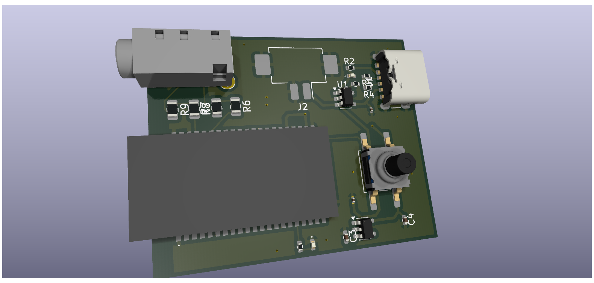

# Custom Bluetooth Audio Interface PCB

A custom printed circuit board designed to integrate a Bluetooth audio module with a micro-USB interface and dual audio jacks. 

## Technical Details
* **Core IC:** FM9688 (Power Management / Buck Converter)
* **Design Software:** KiCad 
* **Key Features:** Component-level power regulation, optimized trace routing for audio clarity, and an SPDT switch interface.

## Included Files
* KiCad source files (Schematic & PCB layout)
* PDF Schematic for quick viewing
* Ready-to-manufacture Gerber files

